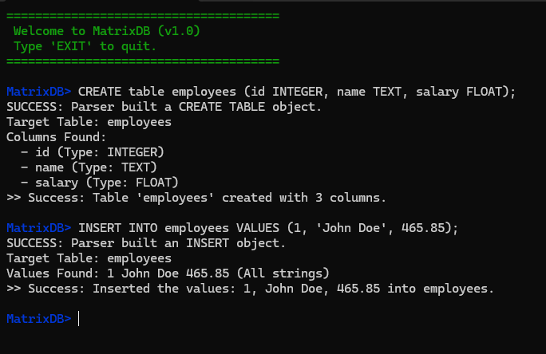
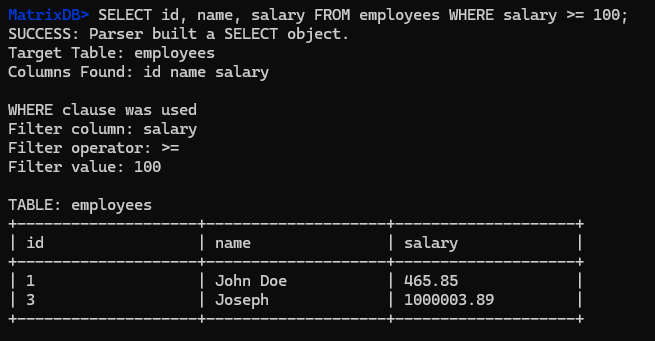
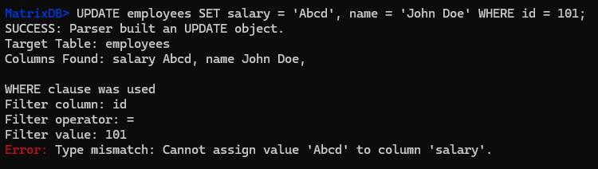

# 🗄️ MatrixDB: Custom C++ SQL Database Engine

A lightweight, in-memory relational database engine built entirely from scratch in modern C++. 

This project implements a custom Lexical Analyzer (Lexer), a state-machine Parser, and an Execution Engine to process standard SQL queries. It supports full **C.R.U.D.** operations, strict data typing, and safe memory management without relying on external database libraries like SQLite.

## 📸 Demo

**1. Creating tables and inserting strictly-typed data:**


**2. Querying data with complex WHERE clause filtering:**


**3. Safe execution with strict type validation (Catching errors):**


## ✨ Features

* **Custom Tokenizer:** Converts raw SQL strings into actionable tokens.
* **State-Machine Parser:** Validates SQL grammar and generates an Abstract Syntax Tree using smart pointers (`std::unique_ptr`).
* **Full CRUD Support:** `CREATE`, `INSERT`, `SELECT`, `UPDATE`, `DELETE`, and `DROP`.
* **Where Clause Filtering:** Row-by-row evaluation supporting `<`, `>`, `<=`, `>=`, and `=` across `INTEGER`, `FLOAT`, and `TEXT` data types.
* **Strict Type Validation:** Prevents fatal type-mismatch errors during `UPDATE` and `INSERT` commands.
* **Memory Safety & Performance:** Utilizes modern C++ features (RAII, iterators, pass-by-reference) for zero-leak memory management and highly optimized execution routes.

## 🛠️ Supported SQL Syntax

The engine strictly enforces SQL grammar. Here are examples of supported commands:

### 1. Create a Table
```sql
CREATE TABLE users (id INTEGER, name TEXT, balance FLOAT);
```

### 2. Insert Data
```sql
INSERT INTO users VALUES (1, 'Alice', 4500.50);
```

### 3. Read (Select) Data
```sql
SELECT * FROM users;
SELECT name, balance FROM users WHERE balance > 1000;
```

### 4. Update Data
```sql
UPDATE users SET balance = 5000, name = 'Alessia' WHERE id = 1;
```

### 5. Delete Data
```sql
DELETE FROM users WHERE balance < 500;
```

### 6. Drop Table
```sql
DROP TABLE users;
```